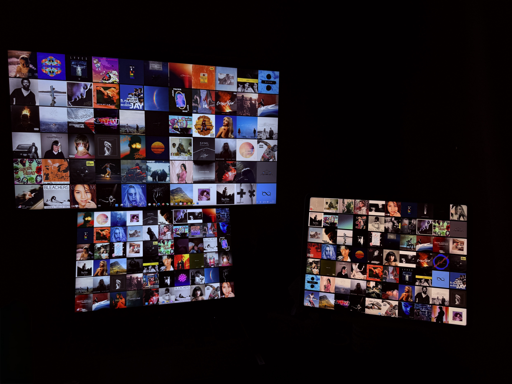

---

# ArtfulWall 壁纸自动更新程序

## 项目简介
ArtfulWall 是一款专为 Windows 平台设计的智能壁纸自动更换程序。它提供多显示器支持，能够为每个屏幕独立设置壁纸，并适应不同分辨率、方向及 DPI 缩放。程序可以动态随机更新网格中的图片。ArtfulWall 致力于为追求个性化、爱好音乐、专辑封面、桌面美学的用户提供流畅、稳定且高度可定制的壁纸体验。

<table>
  <tr>
    <td></td>
    <td></td>
  </tr>
</table>

## 主要特性
- **系统托盘运行**：程序常驻后台，通过右键托盘菜单可快速访问所有核心功能，如配置编辑、打开图片文件夹、设置开机自启及退出程序。
- **高级多显示器支持**：
    - **独立壁纸**：可为每个连接的显示器生成并设置独一无二的壁纸。
    - **自动适配**：智能检测并适应各显示器的分辨率、物理尺寸和显示方向（横向/纵向）。
    - **模式切换**：支持“每个显示器使用独立壁纸”和“单一壁纸应用于所有显示器”两种模式。
- **DPI 缩放精准适配**：自动检测每个显示器的 DPI 缩放级别，确保在高 DPI 环境下壁纸依然清晰锐利，不变形、不模糊。
- **自定义壁纸网格拼贴**：允许用户为每个显示器（或全局）自定义壁纸的行列数，将多张图片智能裁剪并拼贴成一张统一的壁纸。
- **灵活的壁纸切换间隔**：用户可配置壁纸切换的最小和最大时间间隔（单位：秒），程序将在此范围内随机选择时间进行切换。
- **便捷的壁纸资源管理**：
    - 一键从托盘菜单快速打开用户指定的壁纸图片源文件夹。
    - 支持常见的图片格式，如 JPG, JPEG, PNG, BMP。
    - **目标文件夹**：生成的壁纸（如拼贴后的图片）会保存在源图片文件夹下的 `my_wallpaper`子目录中。
- **可视化配置编辑器**：
    - 内置图形化配置编辑界面，方便用户调整各项参数。
    - **热更新支持**：大部分配置更改（如图片文件夹、切换间隔、网格布局等）支持保存后立即生效，无需重启应用程序。
    - **多显示器独立配置**：可在编辑器中为每个显示器单独设置网格行列数。
- **配置备份与恢复**：
    - 程序启动时会自动备份当前的有效配置文件 (`config.json`) 为 `config_backup.json`。
    - 在主配置文件丢失或损坏时，程序会尝试从备份文件恢复。
- **开机自启动管理**：提供一键设置或取消程序随 Windows 系统启动的功能，操作结果会实时反馈在托盘菜单的复选框状态上。
- **高性能图像处理与缓存**：
    - 内置基于 LRU (Least Recently Used) 策略的图像缓存机制，缓存最近使用过的、经过处理（如缩放、裁剪）的图片，提高重复加载大图或进行多图拼贴时的性能。

## 配置说明
- 支持全局与每显示器独立配置（分辨率、网格、DPI）。
- 典型配置字段（详见 `config.json`）：
  - `FolderPath`：壁纸图片文件夹
  - `Width`/`Height`：壁纸分辨率
  - `Rows`/`Cols`：拼贴网格
  - `MinInterval`/`MaxInterval`：切换间隔（秒）
  - `Mode`：`PerMonitor`（多显示器独立）或 `Single`（单一壁纸）
  - `MonitorConfigurations`：每显示器独立设置（可选）

## 使用方法
1. 启动程序后，系统托盘出现 ArtfulWall 图标。
2. 右键菜单可设置开机自启、编辑配置、打开图片文件夹、退出等。
3. 编辑配置后可选择立即生效或下次启动生效。
4. 支持多显示器、DPI 缩放、壁纸拼贴等高级自定义。

## 系统要求
- Windows 10/11
- .NET 7.0+ Runtime
- 支持多显示器与高分辨率

## 安装与运行
1. 下载并解压安装包。
2. 运行 `ArtfulWall.exe`，首次启动自动生成配置文件。
3. 可通过托盘菜单或 `config.json` 进行个性化设置。

## 目录结构
- `Core/Program.cs`：主入口，托盘与主循环、配置加载、业务调度。
- `Services/WallpaperUpdater.cs`：壁纸生成与切换核心，支持多显示器、DPI、网格拼贴。
- `Services/ImageManager.cs`：高性能图像缓存与异步加载。
- `Models/Configuration.cs`：全局与多显示器配置模型。
- `Models/Grid.cs`：壁纸网格单元，负责图片绘制。
- `UI/ConfigEditorForm.cs`：可视化配置编辑器，支持热更新。
- `Utils/DisplayManager.cs`：多显示器与 DPI 检测。
- `Utils/DesktopWallpaperApi.cs`：系统级壁纸设置。
- `Utils/WallpaperSetter.cs`：传统壁纸设置兼容。
- `config.json`：主配置文件，支持手动与可视化编辑。

## 贡献
欢迎提交 Issue 和 Pull Request！如果您有任何改进建议或发现了 Bug，请随时提出。

## 证书
本项目采用 MIT License 许可，详情请参见 LICENSE 文件。

---

# ArtfulWall - Automatic Wallpaper Updater

## Project Introduction
ArtfulWall is an intelligent automatic wallpaper changing program designed specifically for the Windows platform. It offers robust multi-monitor support, capable of setting independent wallpapers for each screen and intelligently adapting to different resolutions, orientations, and DPI scaling. The program can dynamically and randomly update the images in the grid to reduce aesthetic fatigue. ArtfulWall aims to provide a smooth, stable, and highly customizable wallpaper experience for users who seek personalization and appreciate music, album art, and desktop aesthetics.

## Main Features
- **System Tray Operation**: The program runs persistently in the background. Access all core functions quickly via the right-click tray menu, such as editing configurations, opening the image folder, setting auto-start, and exiting the program.
- **Advanced Multi-Monitor Support**:
    - **Independent Wallpapers**: Generate and set unique wallpapers for each connected monitor.
    - **Automatic Adaptation**: Intelligently detects and adapts to each monitor's resolution, physical size, and display orientation (landscape/portrait).
    - **Mode Switching**: Supports two modes: "Independent wallpaper for each monitor" and "Single wallpaper applied to all monitors."
- **Precise DPI Scaling Adaptation**: Automatically detects the DPI scaling level of each monitor, ensuring wallpapers remain sharp and clear in high DPI environments, without distortion or blurring.
- **Custom Wallpaper Grid Collage**: Allows users to define custom row and column counts for the wallpaper grid on each monitor (or globally), intelligently cropping and tiling multiple images into a single unified wallpaper.
- **Flexible Wallpaper Switching Interval**: Users can configure minimum and maximum time intervals (in seconds) for wallpaper changes. The program will randomly select a time within this range to switch.
- **Convenient Wallpaper Resource Management**:
    - Quickly open the user-specified wallpaper image source folder with one click from the tray menu.
    - Supports common image formats such as JPG, JPEG, PNG, BMP.
    - **Target Folder**: Generated wallpapers (e.g., tiled images) are saved in the `my_wallpaper` subdirectory within the source image folder.
- **Visual Configuration Editor**:
    - Built-in graphical interface for users to easily adjust various parameters.
    - **Hot-Reload Support**: Most configuration changes (e.g., image folder, switching interval, grid layout) take effect immediately after saving, without needing to restart the application.
    - **Independent Multi-Monitor Configuration**: Set grid row and column counts individually for each monitor within the editor.
- **Configuration Backup and Restore**:
    - The program automatically backs up the current active configuration file (`config.json`) to `config_backup.json` upon startup.
    - If the main configuration file is lost or corrupted, the program will attempt to restore from the backup.
- **Auto-Start Management**: Provides a one-click option to set or cancel the program from starting automatically with Windows. The result is reflected in real-time via a checkbox in the tray menu.
- **High-Performance Image Processing and Caching**:
    - Features an LRU (Least Recently Used) based image caching mechanism. It caches recently used and processed (e.g., scaled, cropped) images to improve performance when repeatedly loading large images or creating multi-image collages.

## Configuration Details
- Supports global and per-monitor independent configurations (resolution, grid, DPI).
- Typical configuration fields (see `config.json` for details):
  - `FolderPath`: Wallpaper image folder
  - `Width`/`Height`: Wallpaper resolution
  - `Rows`/`Cols`: Collage grid
  - `MinInterval`/`MaxInterval`: Switching interval (seconds)
  - `Mode`: `PerMonitor` (independent per monitor) or `Single` (single wallpaper for all)
  - `MonitorConfigurations`: Per-monitor specific settings (optional)

## How to Use
1. After launching the program, the ArtfulWall icon will appear in the system tray.
2. Right-click the tray icon to access options like setting auto-start, editing configuration, opening the image folder, exiting, etc.
3. After editing the configuration, changes can take effect immediately or upon the next startup.
4. Supports advanced customizations like multi-monitor setups, DPI scaling, wallpaper collage, etc.

## System Requirements
- Windows 10/11
- .NET 7.0+ Runtime
- Multi-monitor and high-resolution support

## Installation and Execution
1. Download and extract the installation package.
2. Run `ArtfulWall.exe`. A configuration file (`config.json`) will be automatically generated on the first launch.
3. Personalize settings via the tray menu or by directly editing `config.json`.

## Directory Structure
- `Core/Program.cs`: Main entry point, system tray management, main loop, configuration loading, and business logic dispatch.
- `Services/WallpaperUpdater.cs`: Core wallpaper generation and switching logic, with support for multi-monitor, DPI, and grid collage.
- `Services/ImageManager.cs`: High-performance image caching and asynchronous loading.
- `Models/Configuration.cs`: Data models for global and multi-monitor configurations.
- `Models/Grid.cs`: Represents a wallpaper grid cell, responsible for image drawing.
- `UI/ConfigEditorForm.cs`: Visual configuration editor with hot-reload support.
- `Utils/DisplayManager.cs`: Multi-monitor and DPI detection utilities.
- `Utils/DesktopWallpaperApi.cs`: System-level wallpaper setting functionalities.
- `Utils/WallpaperSetter.cs`: Compatibility for traditional wallpaper setting methods.
- `config.json`: Main configuration file, supports both manual and visual editing.

## Contributing
Issues and Pull Requests are welcome! If you have any suggestions for improvement or have found a bug, please feel free to raise them.

## License
This project is licensed under the MIT License - see the LICENSE file for details.

---
